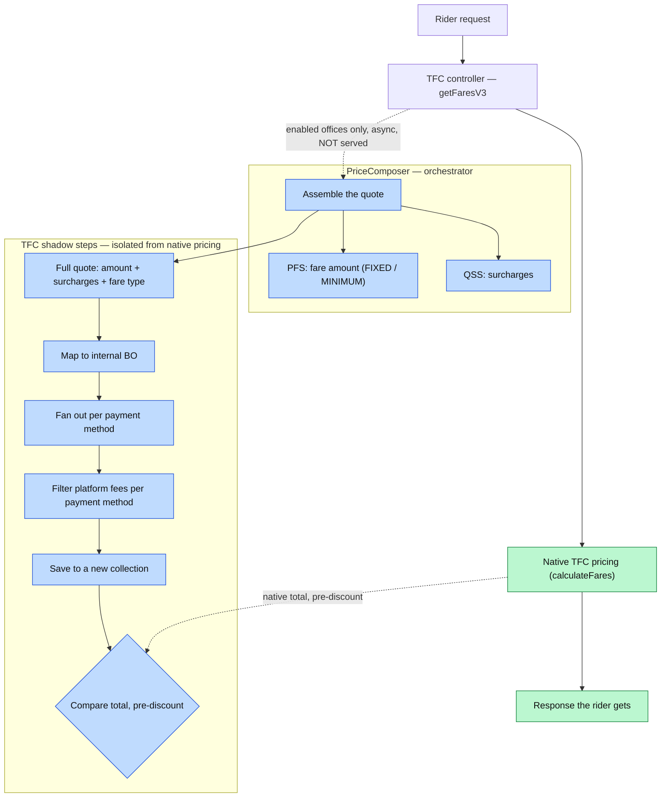
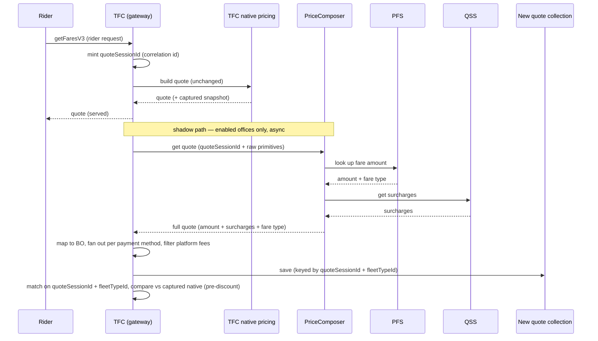

# FreeNow quotes via PriceComposer — architecture (Starting with Predefined Quotes)

## In one paragraph

We are moving FreeNow's pricing onto Lyft's PriceComposer (PC). PC becomes the orchestrator: it calls
the pricing services itself, builds the **whole quote**, and hands it back. 
TFC stays the gateway that riders talk to. For now the PC path runs **on the side, in shadow** — TFC still serves every quote from its own native pricing flow, and we compare the PC result against it. We only switch to PC when we reach feature completion. 
We wire up **predefined fares first** because they're the simplest fare type to move; the same design carries the other fare types later.
In general, we try to return Quotes from PC. The concept of Predefined, Metered, Upfront (price models) is more metadata and not a type of quote. This will also help us move away from the coupled hierarchy of quote types that exists today in TFC.

## Why we're doing this

Today TFC builds the quote itself: it fetches the amounts, adds surcharges, and assembles the result
inside its own pricing code. That logic is FreeNow-specific and hard to share with the rest of Lyft.
The fare type doesn't change the shape of this — PC returns a quote either way; predefined is simply where we start.

## The pieces

| Piece | Role |
|---|---|
| **TFC** | The gateway. Takes the rider request, calls PC, maps the answer, stores it, compares it against native. Keeps serving native quotes. |
| **PriceComposer (PC)** | The orchestrator. Calls the pricing services it needs, assembles the full quote, tags it with a fare type, returns it. Holds no state. |
| **PFS** (PredefinedFareService) | Looks up the fare **amount** for each fleet type. |
| **QSS** (QuoteSurchargeService) | Returns the **surcharges** to add on top. |

## How a request flows

- **Green** is what the rider gets — native TFC, unchanged.
- **Blue** is the PC shadow path — enabled offices only, runs async, not served yet.

## Step by step

## What PC returns

PC returns a **lean quote** — not a copy of TFC's internal model. Per fleet type:

- `fleetTypeId`
- total amount, including surcharges
- currency
- a **fare-type tag** so TFC knows how to treat it (e.g. `FIXED` = a set price, `MINIMUM` = a floor)
- the surcharge amount carried separately, and each surcharge marked **platform-fee** or
  **driver-fee**, so TFC can filter platform fees per payment method

TFC maps this into its own (new) business object (BO), fans it out per payment method, filters platform
fees, and stores it. TFC does **not** re-run surcharges or apply discounts on this path.

## Shadow mode and rollout

- Native TFC serves every quote. The PC path is compared, never served, until a market is cut over.
- The PC call is gated (per office to start) and runs async, so it never slows down the rider.
- We compare the **total price before any discount**. Discounts and coupons are out of this path.
- When a market's numbers match, we switch that market to serve from PC.

## Latency, load & correlation

### Does the served quote get slower? No — if the PC path stays off the critical path

The controller returns the native quote as soon as `calculateFares` finishes. The PC call runs on a
background task that outlives the response. The compare does **not** happen before we respond: TFC
snapshots the native totals, returns the quote to the rider, and the background task compares once PC
answers. So PC being slow can't delay the rider — the "meeting point" for the compare is after the
response is already sent.

This only holds if the background work is genuinely isolated:

- a **dedicated, bounded** thread pool — not the request pool;
- a **firm timeout** on the PC call;
- **drop-on-saturation** — shed the shadow call rather than queue it unbounded (a dropped comparison
  is fine; a slowed rider is not);
- ideally a **circuit breaker** so a PC brown-out trips off instead of dragging.

Async on the request's own pool is not isolation. Get these right and PC latency is fully walled off
from the served quote.

### Load on PFS and QSS — expect ~2× on the shadowed slice

During shadow, **both** paths run for enabled offices: native TFC calls PFS directly to serve the
quote, and PC also calls PFS + QSS for the shadow. So PFS sees roughly **double** its predefined
traffic on the shadowed offices. After cutover, PC's call replaces TFC's, so it drops back toward 1×.

- Size PFS/QSS for the 2× on the enabled slice, and roll offices out gradually.
- Kill the per-fleet-type multiplier: **batch** the PFS/QSS calls (one call for all fleet types), not
  one call per fleet type. (Open in PRC-7772 / PRC-7814.)

### QSS is a new endpoint

A new endpoint means the existing surcharge-serving path is untouched — no latency risk to today's
callers. Nuance: a new endpoint isolates the **code path**, not the **shared backend** (datastore,
CPU, pods).

### When the shadow task starts, and what the "snapshot" is

The PC path is triggered inside `getFaresV3`, right after `calculateFares` produces the native results
and just before we return the response:

1. compute the native quotes;
2. take a **snapshot** — a small in-memory map of `fleetTypeId → pre-discount total` pulled from those
   results (not the whole object, not a DB write);
3. hand the snapshot — plus `quoteSessionId` and the raw primitives — to the background task and let it
   run;
4. return the native response to the rider.

Step 4 does not wait for the task. When PC answers later, the task already holds the snapshot, so it
lines the two up on `fleetTypeId` with no re-fetch. (Alternative: the task could re-read the persisted
native quote via `findAllByQuoteSessionId` instead of holding the snapshot — a DB round-trip vs an
in-memory reference; holding it avoids depending on the native write having finished.)

### Correlation — reuse quoteSessionId

TFC already has a `quoteSessionId`: one id per `getFaresV3` request that links all quotes in that
request. It's stamped on every fare result and persisted on `PriceQuoteData` (indexed, queryable via
`findAllByQuoteSessionId`). Today it's minted deep in the flow — inside `calculateFares`
(`FareCalculatorService.kt:116`). **Move it up to the controller (`getFaresV3`)** and pass it into
both `calculateFares` and the PC shadow task, so both sides share one id.

- **Don't join on quoteId** — native and PC each mint their own quoteId for the same logical quote.
  Join on `quoteSessionId + fleetTypeId` (plus any dimension that splits a quote, e.g. payment method
  after fan-out).
- The background task already holds the **native snapshot** (handed to it when it was spawned), so
  the in-task compare just lines up quote-by-quote on `fleetTypeId`. `quoteSessionId` is what lets
  **offline** reconciliation match the PC collection against native `PriceQuoteData`.
- **Gotcha:** once the controller returns, request-scoped state (ThreadLocals, MDC, security context)
  is gone. The background task must capture everything it needs — `quoteSessionId`, the raw
  primitives, the native snapshot — as plain values **before** responding.
- If PC times out or errors: drop the compare, bump a miss/timeout metric, discard the snapshot. The
  rider already has their quote.

### A useful side effect

Shadow mode measures **real PC end-to-end latency** (TFC → PC → PFS + QSS, network hops and all) with
zero risk to riders, because it's off the critical path. That's the number you'll live with at
cutover, when PC moves onto the critical path and served latency becomes
`PC overhead + max(PFS, QSS) + network`. Set a latency budget and check it per market from the shadow
data before flipping.

## Scope

- **First step:** wire predefined fares through PC — the simplest fare type to move. The same design
  (PC orchestrates, TFC is the gateway, shadow-first) carries the other fare types afterward.
- Surcharges are owned by PC (from QSS). Platform-fee filtering per payment method stays on the TFC side.
- **Out for now:** coupons and vouchers — owned by a growth team. If FreeNow vouchers are ever needed,
  TFC applies them, not PC. Reading the stored PC quote back out (retrieval) is a later step too.

## Open questions

- **B2B (businessAccountId) placement** — resolve it in TFC, in a new PFS endpoint, or leave it out
  at first. Decide after we measure how often B2B fares actually happen.
- **TFC vs QCSS** — we will start with building into TFC and call out early if we feel that using QCSS makes it easy for us to build out the solution.
- **Which market to launch on** and the **exact shadow enablement key** (office / country / passenger
  / geohash).

## How the work is split

Epic **PRC-7770** details this out.