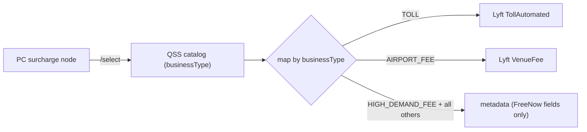
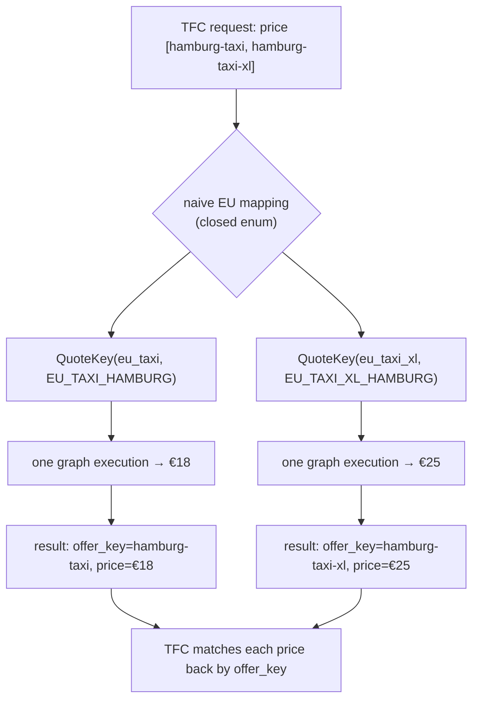
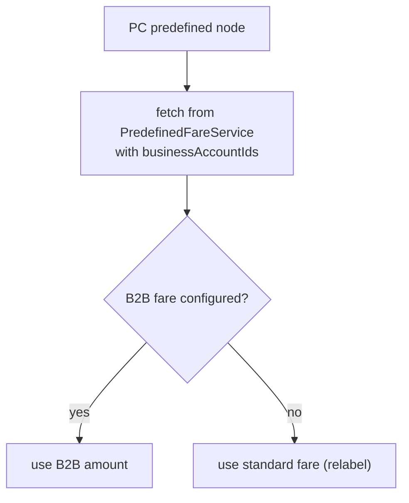
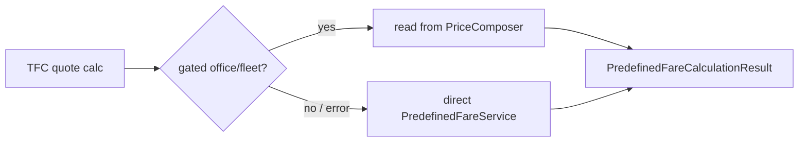
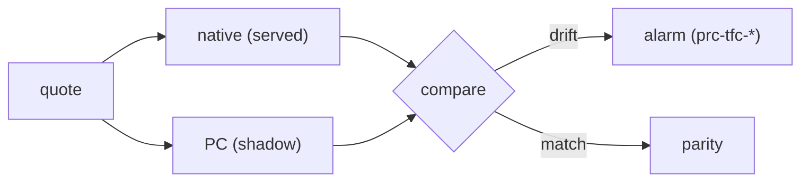

# Rider Pricing Unification — Predefined Fares & Surcharges (Phase 2)

**Part of:** [Full Base-Price Orchestration (Phase 2)](rider-pricing-unification-phase2-tech-spec.md) — shared architecture, endpoint & graphs, cardinality, connectivity, rollout live on the hub page.
**Siblings:** [Metered fares](rider-pricing-unification-phase2-metered.md) · [Upfront fares](rider-pricing-unification-phase2-upfront.md)
**Adoption order:** steps 1–2 (predefined amount, then surcharges) — the fetch/fuse workstream, adopted first.

---

## Component: predefined fares

Predefined has no calculation: PC owns fetch and select, and (once surcharges are relayed) the surcharge-fused build. Scope is **fetching only**: PC reaches predefined fares by **calling back to FreeNow's `PredefinedFareService` over egress** — the service is *not* migrated into Lyft infra (decided 2026-08-24; migration ruled out as excessive scope). Lyft has no predefined-fare concept, so predefined fields are FreeNow-native and travel as metadata.

**Request** (built by TFC enrichment, `FareCalculationRequest.toPredefinedFareBulkRequest`):

```
pickup: List<Long>        // polygon ids
dropOff: List<Long>       // polygon ids
dateTime: OffsetDateTime
fleetTypes: List<FleetType>   // FleetType { fleetTypeId: String, bookingOptions: String }
businessAccountIds: List<Long>
bookingOfferType: String
officeId: Long
isMultiStopTour: Boolean  // multi-stop tours receive only non-minimum predefined fares
```

**Response** — `PredefinedFareBulkResponse`, keyed by fleet type (`predefinedfareservice` `PredefinedFareV2Response.kt`):

```
byFleetType: Map<String, List<PredefinedFareResponseV2>>

PredefinedFareResponseV2 {
  uuid: UUID
  fareType: FIXED | MINIMUM | MAXIMUM
  amountInLong: Long
  currency: String
  businessAccountId: Long?
  commissionPercentage: Double?
  priceModelHighlightTranslationKey: String?
}
```

Build fuses surcharge into the total (`PredefinedFareBulkSelector`: `totalAmount = base + surcharge`). PC can own the full predefined path only once surcharges are relayed through PC (see [Component: surcharges](#component-surcharges)); until then PC owns fetch + select and TFC does the surcharge-coupled build.

**Insertion point:** a gated parallel branch in `FareCalculatorService.calculateFares`, alongside the existing `predefinedFareBulkAsync` fetch. TFC maps the returned line items to `PredefinedFareCalculationResult` with no change to the served quote until the field is at parity.

### Business-account (B2B) handling

For a B2B account the predefined fare *value* can genuinely differ — not a discount layered on top (as NA's `EnterpriseUpfrontDiscountNode` does) — so PC cannot copy a Standard result and re-label it. Grounded in the current TFC/predefinedfareservice code:

- TFC's **enrichment step** (`FareCalculationRequestEnricherService`, runs before calculation) resolves the rider's payment methods from `PaymentGatewayService` and extracts `businessAccountIds` from them (each payment method carries a `businessAccountId`) — so the ids are already resolved TFC-side today.
- Those `businessAccountIds` are already sent in the predefined bulk request (`toPredefinedFareBulkRequest`), and `predefinedfareservice` returns **genuinely different B2B amounts** as distinct fare rows when configured (`FixedFareRepository` query keyed on `businessAccountId`).
- **Proposed EU flow:** TFC passes the already-resolved `businessAccountIds` to PC → PC forwards them to `PredefinedFareService` (whose contract already accepts them). This keeps payment/B2B resolution in TFC (consistent with the payment-stays-in-TFC decision) and makes PC a pass-through — preferable to having PC re-resolve B2B from `passengerId`.
- **Fallback to replicate:** when no B2B fare is configured, TFC today falls back to the B2C fare and merely relabels it (stamps `businessAccountId`, resets `quoteId`, strips discounts/credits). PC (or TFC) must preserve this `b2bFare ?: defaultFare` fallback.

Open point: confirm this passthrough is the agreed contract vs the PR #3033 "pass raw `passengerId`, resolve internally" phrasing; see [Open questions](rider-pricing-unification-phase2-tech-spec.md#open-questions).

---

## Component: surcharges

FreeNow and Lyft model surcharges as structural opposites. FreeNow's `quotesurchargeservice` (QSS) is a **single catalog**: every fee — city, toll, airport, clean-air, prebook, holiday, high-demand, booking, ETA-based — is one `SurchargeConfiguration` discriminated by `businessType` (13 values) and `category` (`PLATFORM_FEE` / `DRIVER_FEE` / `UNCATEGORIZED`), with a generic three-part amount (fixed + percentage-of-base + elastic/surge). PriceComposer has **no such catalog**: each fee is its own graph node with its own upstream client and its own typed line item (`TollAutomated`, `VenueFee`, `TrustAndSafety`, `LyftEventSurcharge`, …). There is no generic surcharge type to receive FreeNow's business types, and most FreeNow surcharges have no Lyft equivalent.

The relay maps the few that map cleanly and passes the rest through as metadata, keeping Lyft's domain agnostic of FreeNow. Lyft's core pricing domain — the shared line-item enum and graph types — learns nothing about FreeNow: all FreeNow knowledge is confined to (a) the FreeNow relay node inside PC and (b) the PC↔TFC wire contract.

**Mapping (allowlist — default is metadata):**

| FreeNow `businessType` | Lyft line item |
| :---- | :---- |
| `TOLL` | `TollAutomated` |
| `AIRPORT_FEE` | `VenueFee` (airport) |
| `HIGH_DEMAND_FEE` | metadata only — overlaps PrimeTime; mapping would double-count surge |
| all others | metadata |

**How TFC calls it (grounded).** TFC's quote calc calls QSS **once, in bulk**: `POST /api/v1/surcharges/select` (`QuoteSurchargeService.selectQuoteSurcharges`), passing a `selectionOptions` list that covers every `fleetTypeId × paymentMethod` in the quote. QSS has **no `/bulk` endpoint**, and TFC does **not** call `/apply` — the percentage-of-base is applied later, TFC-side (see Build). The relay mirrors this exact `/select` call.

**Request** (`SurchargeSelectionRequestDto`):

```
pickup / dropOff - Location { polygonIds: [Long], officeId: Long?, countryCode: String, geoCoordinates: { latitude, longitude: Double } }
dateTime         - OffsetDateTime
routeId          - String
bookingOfferType - String (ACTUAL | ADVANCE)
passengerId      - Long?
selectionOptions - [ { fleetTypeId: String, paymentMethod: { id: Long, type: String, businessAccountId: Long? }, eta: Long } ]
```

No base fare — `/select` is a selection, not a computation.

**Response → data shape.** `/select` returns `items`, one per `selectionOption`, each with a list of surcharges; TFC groups by `fleetTypeId` and merges surcharges across payment methods (`SurchargeMapper.toBo` → `SurchargesByFleetType = Map<fleetTypeId, List<SurchargeBo>>`). Each surcharge is FreeNow-faithful, plus a nullable Lyft-mapping annotation set only when mappable:

```
SurchargeEntry {
  // FreeNow-faithful (from QSS /select)
  configId, businessType, category, currency, description, translationKey,
  fixedAmount:      { valueInMinor: Int, elastic: Bool, experiments[] },
  percentageAmount: { value: rate, maxValueInMinor: ceiling } | null,
  binConfiguration: { minValueInMinor, maxValueInMinor } | null,   // fare boundary
  selectionOption:  { fleetTypeId, paymentMethod }
  // set only for TOLL / AIRPORT_FEE, null otherwise
  lyftMapping: { type, subType } | null
}
```

TFC reads the FreeNow fields to rebuild `SurchargeBo` / `FareSurchargeInfo` (unchanged behaviour, shadow-safe). PC reads `lyftMapping`: non-null → materialize a native `TollAutomated` / `VenueFee` for its full-quote representation; null → the entry stays metadata and never becomes a Lyft domain object.

**Relay** (same five-layer template as the PrimeTime relay — see [the relay template](rider-pricing-unification-phase2-tech-spec.md#proxying-to-freenow-the-relay-template)): IDL `freenow_surcharges.proto` (bulk `/select` shape) → PC ingredient node calling QSS `/select` over egress → PC relay node applying the mapping table → PC → FreeNow egress + auth → TFC read behind a `SurchargeProvider` seam, gated per office/fleet, fallback to the direct QSS `/select` call, in shadow.

**Build / fusion (TFC-side).** The percentage-of-base and the final sum are computed **in TFC**, not QSS: `FareSurchargeCalculator.calculateSurcharges(baseAmountInMinor)` does, per surcharge, `amount = round( min( base × percentage/100 + fixedAmount, ceiling ) )` (fixed-only when `percentage = 0`), summing to `FareSurchargeInfo.fareSurchargeAmountInMinor`. Because this needs the base fare — which isn't in PC during the surcharge-first slice — **fusion stays in TFC**; the relay moves only the *selection*. Once base pricing also lives in PC, the fusion step can follow. TFC remains the source of truth for representation and breakdown throughout.

## Proposed Flow

```mermaid

sequenceDiagram
    participant R as Rider / upstream
    participant TFC as TFC (FareCalculatorService)
    participant PC as PriceComposer (pricecomposereurope)
    participant PFS as PredefinedFareService (FN)
    participant QSS as QuoteSurchargeService (FN)

    R->>TFC: quote request (pickup, dropoff, fleetTypes[Taxi, PHV], riderId)

    Note over TFC: Enrich (TFC-side, unchanged): PolygonService → pickup/dropoff polygonIds,<br/>resolve officeId + countryCode + coords, dateTime, bookingOfferType

    TFC->>PC: GetForPassengerEurope — ONE call<br/>trip context + quote_key_infos[Taxi, PHV]<br/>passengerId (raw), includePaymentMethodFares = false<br/>[gated per office/fleet]

    loop per fleet type → one QuoteKey → one graph execution
        Note over PC: fleetType → QuoteKey = (RideType, PricingKey)<br/>via naive EU mapping (closed enum). OfferKey = fleetTypeId
        PC->>PFS: predefined bulk fetch<br/>(polygonIds, officeId, fleetTypeId, passengerId→B2B, bookingOfferType, dateTime)
        PFS-->>PC: PredefinedFareResponseV2 (FIXED, amountInLong, currency)
        PC->>QSS: POST /api/v1/surcharges/select<br/>selectionOptions[fleetTypeId × paymentMethod], locations, routeId, dateTime
        QSS-->>PC: surcharges (fixedAmount + percentage rate + ceiling, per option)
        Note over PC: Build: total = base + fused surcharge<br/>(base × pct/100 + fixed, capped at ceiling, rounded)<br/>map TOLL→TollAutomated, AIRPORT_FEE→VenueFee, else metadata<br/>emit line_items[]
    end

    PC-->>TFC: QuoteKeyPriceResult[] — one per QuoteKey<br/>each { offer_key = fleetTypeId, line_items[], price_group_id (shared) }

    Note over TFC: Match results by offer_key → fleetType<br/>payment-method fan-out (mapFareCalculationResultToPaymentMethods)<br/>B2B resolved via passengerId, build PredefinedFareCalculationResult<br/>persist + represent (FareFormatService / PriceBreakdownService)

    TFC-->>R: quotes (fleetType × paymentMethod × businessAccount), each own quoteId

  ```

---

## Proposed Implementation Steps In order

Migration steps. At the end, predefined fares (with fused surcharges and B2B) are produced by PriceComposer and served to riders through it, under shadow then cut over. *(Proposal — not yet created in Jira.)*

> The table is **dependency order, not a strict sequence** — steps with the same prerequisites run in parallel (e.g. Step 3 and Step 4b both need only Step 2). **Step 4a is the long pole:** a cross-org ask with no dependencies that gates Step 5 — start it on day one, don't wait for its number to come up.

| # | Step | Depends on |
| :---- | :---- | :---- |
| 1 | Networking & egress: PC → `PredefinedFareService` + QSS (reuse PT egress + Vault RBAC token) | — |
| 2 | IDL contract: europe endpoint request/response covering predefined + surcharge fields | — |
| 3 | Surcharge relay: PC node calls QSS `/select`; apply mapping (TOLL→TollAutomated, AIRPORT_FEE→VenueFee, else metadata) | 1, 2 |
| 4a | Obtain FreeNow's enumerated `fleetType` value list (Vimal/Lucas) — cross-org input for the mapping; **start day one** | — |
| 4b | Add `fleetType → (RideType, PricingKey)` naive EU mapping (closed-enum entries in `idlcode-go`); `OfferKey = fleetTypeId` | 2, 4a |
| 5 | Predefined relay: PC node calls `PredefinedFareService` (fetch + select); pass `businessAccountIds` for B2B, `b2bFare ?: default` fallback | 1, 2, 4b |
| 6 | PC build: fuse surcharge into predefined total; emit `QuoteKeyPriceResult.line_items[]` per QuoteKey | 3, 5 |
| 7 | TFC read side: provider seam, gated per office/fleet, map to `PredefinedFareCalculationResult`, fallback to direct calls | 6 |
| 8 | Shadow + drift alarming (reuse `QuoteCalculationComparisonService` / `prc-tfc-*`) | 7 |
| 9 | Rollout & cut over per office/fleet at parity → predefined served through PC | 8 |

**Done when:** TFC reads the predefined total from PC on the gated path, at parity with native, in the rollout markets.

---

## Step details

The higher-level intent behind each step. Diagrams appear only where they read easier than prose.

### 1. Networking & egress

PC must be reachable from TFC, and each FreeNow source must be reachable from PC — two directional private links with roles reversed, reusing the Phase-1 PrimeTime path and Vault RBAC token.

```mermaid
flowchart LR
  TFC["TFC (FreeNow)"] -->|"call"| PC["PriceComposer (Lyft)"]
  PC -->|"egress"| PFS["PredefinedFareService (FreeNow)"]
  PC -->|"egress"| QSS["QuoteSurchargeService (FreeNow)"]
```

### 2. IDL contract

Define one europe endpoint request/response that can carry the predefined amount plus surcharge fields. This is the shared wire shape both sides build against; every later step plugs into it. (No diagram — it's a schema.)

### 3. Surcharge relay

PC calls QSS `/select` and translates the single FreeNow catalog into Lyft's model. FreeNow describes a fee by `businessType`; Lyft has a distinct line-item *type* only for a few of those. The relay maps by `businessType`: a clean match becomes a **native Lyft line item**, everything else is carried **as metadata** (Lyft's domain never learns the FreeNow concept).

**Field mapping — FreeNow domain → Lyft domain:**

| FreeNow (`businessType`) | Lyft line item | Domain |
| :---- | :---- | :---- |
| `TOLL` | `TollAutomated` | Lyft-native |
| `AIRPORT_FEE` | `VenueFee` (airport) | Lyft-native |
| `HIGH_DEMAND_FEE` | *metadata* (would double-count PrimeTime) | metadata |
| `CITY_FEE`, `CLEAN_AIR_FEE`, `HOLIDAY_FEE`, `PREBOOK_FEE`, `SERVICE_FEE`, `BOOKING_FEE`, `ETA_BASED_FEE`, … | *no Lyft equivalent* | metadata |

Every entry — mapped or not — also carries its FreeNow-faithful fields (`configId`, `businessType`, `category`, `amount`, `currency`, `translationKey`) so TFC can rebuild its native breakdown; the `lyftMapping` annotation is set **only** for the two clean cases.



### 4a. Obtain the fleetType list

The cross-org input for the mapping: FreeNow's **enumerated `fleetType` value list** (owed by Vimal/Lucas). No dependencies, so it starts on day one — it's the long pole that gates Step 5. Everything in 4b is quick once this list is in hand.

### 4b. fleetType → QuoteKey mapping

PC prices per fleet type, but its engine has no concept of a FreeNow `fleetType`. Two keys do two jobs: **QuoteKey `= (RideType, PricingKey)`** is the *input* (what PC prices), and **OfferKey `= fleetTypeId`** is the *output label* (so TFC can match each result back). Each `fleetType` is translated into a `(RideType, PricingKey)` via the **naive EU mapping**; `PricingKey` is a **closed IDL enum**, `OfferKey` a free-form string that carries the raw `fleetTypeId`.



**Where & when the mapping lives.** The table is **PC-owned**, defined in the `pricecomposereurope` Europe registration (the `RideType`/`PricingKey` values are IDL enum entries in `idlcode-go`, added per fleet-type tier). It is **populated before step 5** — the relay can't run a QuoteKey that isn't mapped — and it depends on FreeNow first handing over its **enumerated `fleetType` value list** (open ask to Vimal/Lucas). It is a deliberately naive, temporary table: reconciliation with Core Rider's canonical **Modes** mapping is deferred to Phase 3 / UFO.

### 5. Predefined relay

PC calls `PredefinedFareService` to fetch the fare, passing the rider's `businessAccountIds` so a B2B account gets its own price; if none is configured, it falls back to the standard fare.



### 6. PC build (fuse)

Combine base plus surcharge into one total and emit it as line items — one result per QuoteKey. In short: `total = base + Σ min(base × pct/100 + fixed, ceiling)`. (Compact enough as text.)

### 7. TFC read side

TFC reads the predefined total from PC behind a provider seam, gated per office/fleet, and falls back to its existing direct calls if PC is off or errors — so nothing changes for un-gated traffic.



### 8. Shadow & drift alarming

Before trusting PC, run it alongside native: compute both, compare, alarm on drift. PC's value is never served until it matches.



### 9. Rollout & cutover

Flip PC from shadow to served one office/fleet at a time, once parity holds, keeping the fallback. Progression per market: **off → shadow → served**.