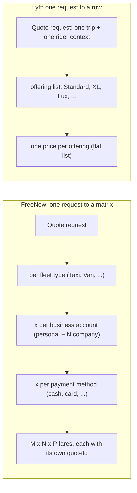

# Rider Pricing Unification — Full Base-Price Orchestration (Phase 2)

**Authors:** Alain Plana, Vimal James
**Status:** Draft
**Scope:** This is the hub for the **full base-price orchestration** track — Phase 2 of the Marketplace Unification price-orchestration migration. It holds the shared architecture; each fare component's deep design is on its own page (see [Component specs](#component-specs)). PrimeTime (Phase 1) is a separate, decoupled track with its own tracks doc; it is referenced here only as the predecessor plug-point.
**Related:** Marketplace Unification – Price Orchestration Migration Strategy · Lyft × FN Phase 1 PT Integration: Workstream Tracks & Scoping · FN Pricing Integration Proposal: Base & Orchestration Layers (leverable / non-leverable framework) · ADR-0001 (protorpc transport) · ADR-0002 (full-quote wire contract) · Lyft Europe Pricing Endpoint tech spec (pricecomposer PR #3033, PRICING-33254)

---

## Overview

The migration turns TaxiFareCalculator (TFC) into a thin wrapper that calls Lyft's PriceComposer (PC) directly. Rather than build the orchestration layer as one sequential effort — or as N one-off endpoints — Phase 2 uses a single strategy: **one general endpoint that returns PC's full computed price, with TFC adopting fields incrementally as each clears shadow.**

PC exposes one endpoint that returns every step of the fare formula. Wherever Lyft-native logic doesn't exist yet, PC proxies that step to FreeNow's own services under the hood. TFC calls PC once and gets the whole response back, but **initially trusts only the one or two fields that have passed shadow-testing** (starting with whatever is earliest in the fare formula), continuing to source the rest from FreeNow as it does today. As each component is shadow-verified, TFC starts trusting that field too — until it trusts the entire response and is a true thin wrapper.

The consequence, and the reason for this shape: **the migration order is controlled entirely by which fields TFC chooses to read — not by how PC is called.** No new endpoints and no versioned calls are needed as more components come online.

Transport is `TFC → PriceComposer`, direct, over the Phase-1 `PriceComposerEuropeApi` Feign client. The Lyft-side entry point is a gRPC RPC in IDL package `lyft/pricecomposer/europe` with a protorpc HTTP frontend for TFC (which has no gRPC stack), hosted in the dedicated `pricecomposereurope` facet — a distinct EU flow, not the NA `GetForPassengerUpfront`.

### Phasing context

- **Phase 1 — PrimeTime / surge only** (separate track, target early Oct 2026): a narrow standalone plug-point so FreeNow's surge relay runs through PC (`TFC → PC → PT → SOS`) instead of directly to SOS. Not the general orchestration mechanism.
- **Phase 2 — Full base-price orchestration** (this doc; start ~Oct 2026, target EOY 2027): the one-endpoint, incremental-field-adoption migration of the base fare and its components.
- **Phase 3 — Full TFC retirement** (post-2027, unscoped): PQ generation, payment methods, and reconciling PC's temporary fleet-type mapping with Core Rider's canonical Modes mapping (UFO integration).

---

## Goals / Non-goals

**Goals**

- PC produces the full base-price response for FreeNow quotes end-to-end, under shadow, over one general endpoint.
- TFC adopts PC-produced fields incrementally, in fare-formula order, with no re-wiring per component.
- Lyft's pricing domain stays agnostic of FreeNow concepts.

**Non-goals (this phase)**

- Full TFC retirement, PQ generation, and payment-method migration — deferred to P3.
- Reconciling the temporary fleet-type mapping with Core Rider's Modes catalog — deferred to P3 (UFO integration).
- Porting FreeNow vouchers — discounts use Lyft-native coupons.
- Moving payment-method logic to PC — it stays in TFC (PC pricing is payment-agnostic).

---

## Design principles

- **One endpoint, full price, incremental field adoption.** PC returns the whole fare formula on one endpoint; TFC trusts fields one at a time as they clear shadow. Migration order = which fields TFC reads, not how PC is called. No per-component or versioned endpoints.
- **Proxy to FreeNow until native exists — the leverable / non-leverable framework.** Per the Base & Orchestration Layers proposal: a component Lyft can compute natively (**leverable**) is moved into PC over time; a component with no Lyft-native equivalent (**non-leverable**) is proxied to FreeNow's service under the hood and its value carried through. Either way PC returns a value for every field from day one.
- **Adopt in fare-formula order.** TFC starts trusting the earliest step in the formula and works forward, so a trusted field never depends on an untrusted upstream one.
- **TFC serves; PC shadows — per field.** Throughout the migration TFC computes and serves the native quote; each PC field is compared against TFC's native value and alarmed on drift (`prc-tfc-*` rules), and is served only once that field is at parity.
- **PC returns a full quote; TFC assembles the FreeNow view.** Per ADR-0002, PC returns one `QuoteKeyPriceResult` with `line_items[]` per QuoteKey. TFC builds the FreeNow-facing price object from those line items; representation and persistence stay in TFC (`FareFormatService` / `PriceBreakdownService` / `PriceQuoteDataService`).
- **Lyft-native where clean, metadata otherwise.** Map FreeNow concepts to Lyft-native types where a clean equivalent exists; carry everything else as opaque metadata so Lyft's domain never learns FreeNow concepts.

---

## The orchestration endpoint & graphs

The Lyft side is specified in the PriceComposer Europe tech spec (pricecomposer PR #3033, PRICING-33254); the orchestration relays plug into that structure.

- **One general endpoint** in the `pricecomposereurope` facet (separate binary/config/deployment, not the main `pricecomposer` service), returning the full computed price. One RPC; the graph choice is internal to PC, not on the wire.
- **Two FN-specific graphs**, selected by **HailingType** (FreeNow's coarse TAXI/PHV split): **FN Upfront (PHV)** and **FN metered (Taxi)**. HailingType has no direct Lyft equivalent (closest: LineOfBusiness).
- **Compartmentalization** — the FN graphs and their nodes live under `node/{ingredients,procedures}/europe/` in the shared `passenger/graphlib/` tree (not a full fork like `ultralux/`), with a separate Europe registration list as the blast-radius boundary that isolates FN pricing from NA upfront pricing.
- **QuoteKey / FleetType / PricingKey** — one graph execution per `QuoteKey`. A FreeNow **FleetType** (fine-grained, opaque per-market identifier) maps to a new EU `RideType`/`PricingKey` pair — one per fleet-type tier needing distinct pricing. `PricingKey` is a **closed enum**, so new pairs require an IDL change in `idlcode-go`, not config.
- **Temporary, naive fleet-type mapping.** The `fleetType → RideType/PricingKey` mapping is PC-owned and deliberately naive — *not* blocked on Core Rider's parallel (still-unsettled) effort to map FreeNow fleet types to Lyft **Modes**. The two are reconciled later, around Phase 3 / UFO integration. Building the mapping depends on FreeNow's enumerated `fleetType` value list (open ask; see [Open questions](#open-questions)).
- **No UFO `mode`** — the EU flow does not use UFO (User Flow Optimizer) mode definitions to identify what to price. A `mode` (owned by the Modes Platform, surfaced by UFO in the rider purchase flow) is a fully-resolved purchasable product; the EU flow instead maps TFC requests straight to code/quote keys. FreeNow↔Lyft mode-catalog mapping is deferred to P3.

---

## Incremental field adoption

The endpoint returns the full fare formula; TFC's `FareCalculatorService` reads it on a gated branch and chooses, per field, whether to trust PC's value or keep FreeNow's. Adoption proceeds in fare-formula order:

1. **Predefined amount** — the earliest, simplest step (a fetch, no calculation); first to adopt.
2. **Surcharges** — fused into the total; adopted once the relay + mapping are at parity.
3. **Metered base** — the first field PC *computes* rather than fetches.
4. **Upfront** — the coupled formula (base × surge, interleaved rounding, two-pass surcharge); last, because it depends on the steps above.

Each component documents its ownership boundary and the shape of the field(s) TFC adopts, on its own page (see [Component specs](#component-specs)). A component is **leverable** (moved into PC natively over time) or **non-leverable** (proxied to FreeNow under the hood); the classification per component is tracked as an open item.

### Proxying to FreeNow: the relay template

For any non-leverable step, PC reaches the FreeNow source through the same five-layer template established by the Phase-1 PrimeTime relay:

1. **IDL contract** (`lyft/idl`) — a ProtoRPC proto for the field(s) + request/response; generates shared models + an HTTP handler stub.
2. **PC ingredient node** (Go graph engine) — calls the FreeNow service over egress and emits the value (native line item where mappable, metadata otherwise).
3. **PC graph wiring** — the node runs inside the relevant FN graph.
4. **PC → FreeNow egress + auth** — sanctioned egress (PrimeTime precedent: PC → PT → SOS).
5. **TFC side** — read the field from the PC response behind a provider seam, gated per office/fleet, with fallback to the direct FreeNow call, running in shadow until parity.

---

## Component specs

Each fare component's deep design lives on its own page, adopted in fare-formula order:

1. **[Predefined fares & surcharges](rider-pricing-unification-phase2-predefined.md)** — steps 1–2: fetch/select predefined via callback to FreeNow's `PredefinedFareService`, plus the surcharge relay fused into the total. Includes B2B handling.
2. **[Metered fares](rider-pricing-unification-phase2-metered.md)** — step 3: the first field PC *computes* (per-distance tariff).
3. **[Upfront fares](rider-pricing-unification-phase2-upfront.md)** — step 4: the coupled base × surge formula, adopted last as a bundle.

Shared architecture — endpoint & graphs, FleetType & cardinality, connectivity, shadow & rollout — is on this page.

---

## FleetType & quote cardinality

**FleetType** is FreeNow's fine-grained, per-market ride-type key. Core price calculation needs only the `fleetTypeId` — `subFleetTypeId` and booking options drive waiting/cancellation fees, not the core price, and requests use only the leading portion of the string. Two Lyft concepts consume it: the coarse **HailingType** (TAXI/PHV) selects which graph runs (FN metered vs FN upfront), and the FleetType maps to a `RideType`/`PricingKey` pair (one per fleet type needing distinct pricing; `PricingKey` is a closed IDL enum). PC builds one `QuoteKey` and runs one graph execution per fleet type — the request lists every applicable fleet type directly (`fleetTypeDetails`), so no discovery call is needed.

The harder difference is **cardinality** — how many priced results one quote request produces.

- **FreeNow returns a matrix.** One request fans out across three dimensions: fleet type × business account (1 B2C + one per `businessAccountId`) × payment method (`mapFareCalculationResultToPaymentMethods`). Each cell is a full fare with its own `quoteId`. The three factors that vary price at request time are fleet type, payment method, and business account; payment method and business account are resolved from the rider id in TFC enrichment, fleet type is explicit.
- **Lyft returns a row.** One request carries a single trip context plus a list of offerings (`repeated quote_key_infos`) and returns one priced result per offering (`repeated quote_key_price_results`) — fanning out on the offering axis only. Payment method is absent from the pricing contract (payment-agnostic). TFC resolves the payment/business-account context in enrichment and passes what PC needs, so PC does not fan out on either.

| Dimension | FreeNow | Lyft (PriceComposer) | Handling |
| :---- | :---- | :---- | :---- |
| Vehicle type | `fleetType` fan-out | ride type / `quote_key` fan-out | Clean 1:1 — send the fleet list as `quote_key_infos` in one batched call |
| Payment method | fare varies per method | absent from pricing | Stays in TFC (`mapFareCalculationResultToPaymentMethods`) |
| Business account | fan-out across N accounts | `businessAccountIds` passed through | TFC resolves the ids in enrichment and passes them to PC → `PredefinedFareService`; see the [predefined page](rider-pricing-unification-phase2-predefined.md#business-account-b2b-handling) |

**Design consequence.** PC answers the pure pricing question — one price per fleet type, for one context — with the fleet list sent as `quote_key_infos` in a single batched call. TFC keeps the payment-method fan-out downstream, where it already lives; PC's own upstream call sets `includePaymentMethodFares = false` (one canonical fare per tier).

**Fan-out mechanics** (per the PR #3033 worked example, grounded in a real request): PC runs one graph execution per fleet type and sets each result's `offer_key` to the `fleetTypeId` string, so the response echoes the exact id TFC sent — TFC matches results back by `offer_key` alone, no lookup table. All results from one request share a single `price_group_id` (one rider session); `offer_key` distinguishes them.

Two keys do two jobs: **QuoteKey `= (RideType, PricingKey)`** is the *input* (what PC prices), and **OfferKey `= fleetTypeId`** is the *output label* (so TFC matches each result back). Each `fleetType` is translated into a `(RideType, PricingKey)` via a PC-owned **naive EU mapping** (`PricingKey` is a closed IDL enum). A worked example, the mapping table, and where/when it's available are on the [predefined page → Step 4](rider-pricing-unification-phase2-predefined.md#4-fleettype-quotekey-mapping).

Business-account (B2B) handling — where a B2B account can carry a genuinely different fare — is covered on the [predefined page](rider-pricing-unification-phase2-predefined.md#business-account-b2b-handling).

---

## Glossary — Lyft terms & FreeNow parallels

Lyft splits into a stack of keys what FreeNow packs into a single `fleetType` string. The stack, top (catalog) to bottom (pricing execution):

| Lyft term | What it is | Closest FreeNow concept |
| :---- | :---- | :---- |
| `product_key` / mode identity | Catalog identity of a product (`lux`, `plus_xxl`, `pet`) — the "what am I buying" name. | Part of what `fleetType` encodes |
| `Mode` | The fully-resolved config of a ride type at a specific origin/destination/time. Many modes → one ride type. Owned by the Modes Platform (`lyft/modes`), surfaced by UFO in the purchase flow. | *No direct equivalent* — FreeNow has no composition layer; `fleetType` is catalog + pricing in one |
| `ride_type` (aka `legacy_name`) | Historical product identity; the real cost-model selector in `fare` — drives rate-card, PrimeTime dispatch, pisco grid. | `fleetType` (its pricing-relevant part) |
| `pricing_key` | Authored on the Product; a closed enum; `fare` derives `offer_key` from it and PrimeTime keys off it. | The pricing identity a `fleetTypeId` maps to — one EU `RideType`/`PricingKey` pair per fleet type |
| `offer_key` | `pricing_key` + attributes; PriceComposer's per-graph key. In the EU flow it is set to the `fleetTypeId` string so TFC matches results back by it. | The echo of the sent `fleetTypeId` in the response |
| `QuoteKey` | PriceComposer's execution key — one graph run per QuoteKey, one priced result. `pricing_key ↔ quote_key` is ~1:1. | One `quoteId` / one priced cell |
| `HailingType` | Coarse TAXI vs PHV split; selects which graph runs (FN metered vs FN upfront). | FreeNow's TAXI/PHV distinction (fed in; no native Lyft twin) |

**Modes** sit *above* pricing: a mode resolves down to `ride_type` → `pricing_key`, which is what pricing keys on. FreeNow has no equivalent — `fleetType` does double duty as catalog identity *and* pricing selector. This is why the EU flow skips UFO modes and maps `fleetType` straight to code/quote keys: pulling in the mode/composition machinery would drag catalog + upsell concerns into what is, for base pricing, a pricing lookup.

**QuoteKey** is the unit of "price this one thing": one graph execution → one result, fanning out on that axis only. The FreeNow parallel is a single `quoteId`, but the cardinality shapes differ — FreeNow emits a *matrix* (`fleetType × businessAccount × paymentMethod`), Lyft a *row* (one result per QuoteKey, payment-agnostic). The integration bridges this by fanning QuoteKeys on fleet type only (`offer_key = fleetTypeId`), keeping payment-method fan-out in TFC, and passing TFC-resolved `businessAccountIds` through to `PredefinedFareService` (see the [predefined page](rider-pricing-unification-phase2-predefined.md#business-account-b2b-handling)).

---

## Connectivity

Phase 1 establishes the network path; Phase 2 reuses it and adds an egress per FreeNow source that must be proxied. Keep three layers separate: **connectivity** (the private network path — AWS PrivateLink), **protocol** (ProtoRPC over HTTP/1.1), and **identity/authz** (Vault-issued RBAC tokens). PrivateLink provides only the path.

PrivateLink is directional: the **provider** exposes an endpoint service (NLB-fronted); the **consumer** holds an interface endpoint and always initiates. The relay therefore needs **two** links, roles reversed:

- **Call** `TFC → PriceComposer` — FreeNow is consumer, Lyft is provider (the Phase-1 direction).
- **Relay egress** `PriceComposer → QSS / PredefinedFareService / FareConfigurationService` — Lyft is consumer, FreeNow is provider (one endpoint service per source proxied).

Auth is settled; the **reverse-direction reachability** (Lyft → FreeNow) is the pacing item — one endpoint service per FreeNow source exposed.

> PC deployment topology (eu-west-1 + VPC peering vs. us-east-1 + Skipper) is infra-owned and explicitly deferred per ADR-0001; it sets the egress path and cross-org latency (FreeNow's estimate: +100–150 ms for PC → FN calls). If the two sides are not same-region AWS, the private path is Transit Gateway / Direct Connect, not PrivateLink — confirm with infra.

---

## Shadow & rollout

- **Per-field shadow.** Each PC field is compared against TFC's native value; TFC serves that field only once it is at parity. TFC serves the native quote and remains the fallback throughout.
- **Gate per office/fleet** on the TFC side.
- **Adopt in fare-formula order**, one field at a time; a trusted field never depends on an untrusted upstream one.
- Comparison and alarming reuse the existing `QuoteCalculationComparisonService` and `prc-tfc-*` rules.

---

## Sizing & resourcing

- **Core work:** ~28–38.5 person-weeks — full translation layer 18–24w; endpoint/graph design 10–14.5w (per the orchestration-layer proposal estimates).
- **Resourcing:** ~1.25 effective engineers (James 100%, Alain 25%, Risha 25%), with a discount for FreeNow ramp-up / run-the-business.
- **Calendar:** ~5–7 months. Starting ~Oct 2026 lands in the **Q2–Q3 2027** range, leaving >1 quarter buffer against the EOY 2027 target for incremental shadow and rollout. Assumes ~1.25 eng holds through 2027.

---

## Open questions

- **P2 requirements boundary.** Exactly what "full base price orchestration" contains — settle, PriceQuote creation, caching — is not yet pinned down.
- **Leverable vs non-leverable classification.** Per-component call on which steps become Lyft-native (leverable) vs stay proxied to FreeNow (non-leverable), per the Base & Orchestration Layers framework.
- **Rate-card lookup key exhaustiveness.** Whether FreeNow's rate-card key `(region, fleet_type, time_window, distance_bucket)` is exhaustive, or whether finer-grained vehicle/partner-level overrides also affect price — needs FreeNow eng confirmation.
- **EU FleetType → RideType/PricingKey values.** The exact pairs per fleet type are pending FreeNow's enumerated `fleetType` value list (owed to Risha by Vimal/Lucas) and a FreeNow–Lyft mapping conversation. Scaffolding doesn't depend on the values; the mapping does.
- **Business-account resolution (contract wording).** Code confirms TFC enrichment resolves `businessAccountIds` (from payment methods via `PaymentGatewayService`) and `PredefinedFareService` already returns B2B-specific amounts by id — so the proposed flow is "TFC passes resolved ids to PC → PC forwards them." Confirm this passthrough is the agreed contract vs the PR #3033 "pass raw `passengerId`, resolve internally" phrasing, and that PC/TFC replicate the `b2bFare ?: defaultFare` fallback.
- **`fleetTypeId` granularity.** Confirm values are always leaf-level (one per rider-facing tier) and never a coarser family PC would need to expand itself.
- **`routeId` handling.** Whether PC passes through the `routeId` / `distance` / `duration` it receives from TFC, or must independently compute a compatible route value — matters if FreeNow's predefined-fare table is keyed on route segments rather than raw distance.
- **Minimum-fare clamp boundary.** `minimum` clamps both upfront and estimated, and predefined-FIXED preempts upfront; keep `minimum` coupled with upfront in TFC, or reconcile across the PC/TFC boundary.
- **Range fares.** Lyft's cost-estimate proto carries legacy min/max fields but currently prefers fixed pricing; confirm how FreeNow RANGE fares are represented on the Lyft side.
- **IDL naming/versioning.** Exact RPC/message names and version in `lyft/pricecomposer/europe`, pending `idlcode-go` review (Lyft-side).
